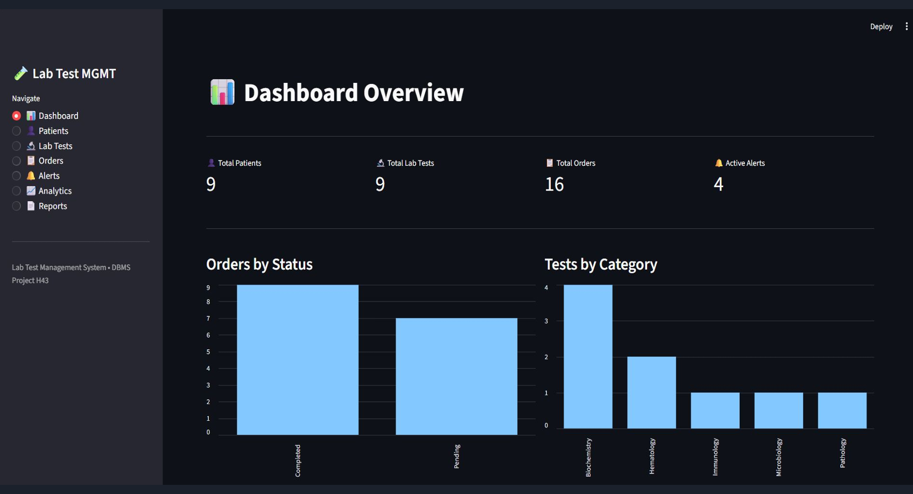
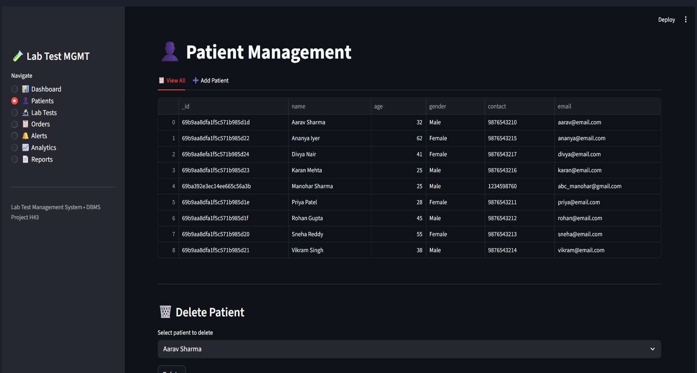
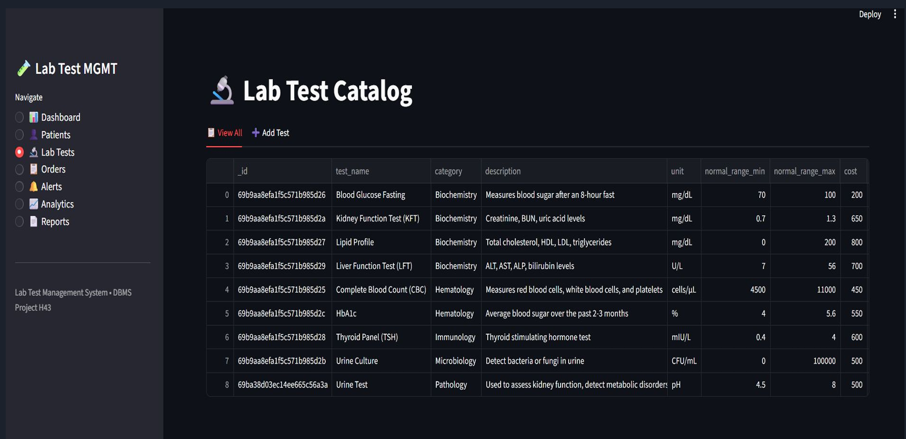
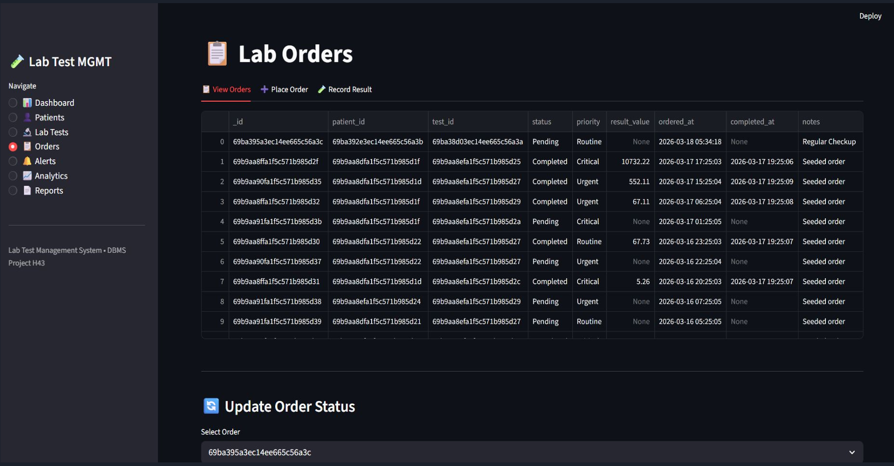
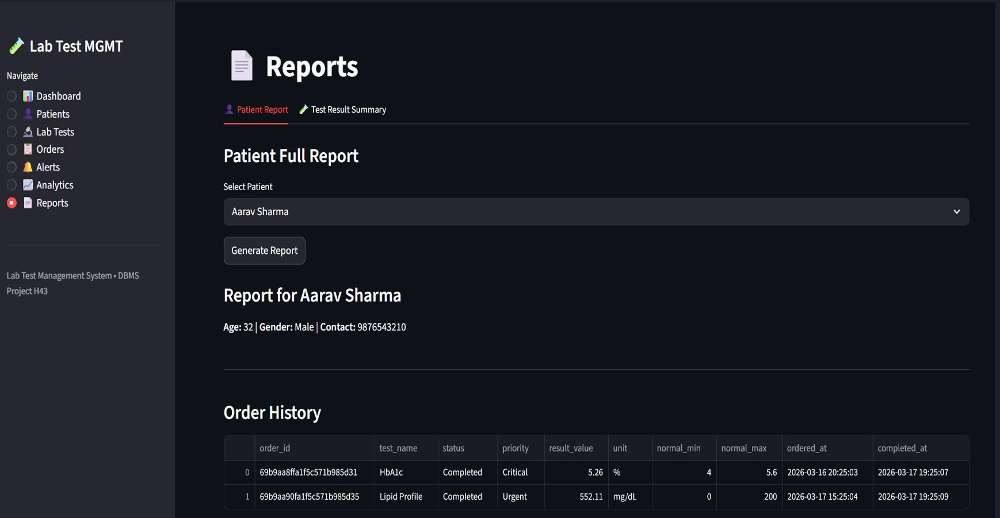
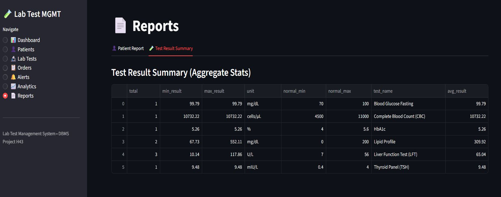

# Lab Test Management System (Module H43)

Developed by Sukrat Singh, Purna Chandra, and Kiran, under the mentorship of Prof. A.C.S. Rao.

## Overview
This project is a Laboratory Test Management Database designed to maintain a complete lab test catalog and an ordering system. It handles various test categories, including Hematology, Chemistry, Microbiology, and Pathology. The system is capable of storing preparation requirements such as fasting, timing, and special handling. It also tracks lab orders, monitors turnaround times, computes delays, and generates utilization and cost-related reports to improve operational decision-making.

## Key Features
* **Patient Management**: Allows users to register, search, and manage patient records.
* **Test Catalog**: Supports defining lab tests with their associated normal ranges and costs.
* **Order Tracking**: Enables placing new orders and tracking their status in real-time.
* **Smart Alerts**: Automatically triggers alerts for critical lab results or delayed orders.
* **Analytics & Reports**: Includes revenue analytics, turnaround monitoring, patient full reports, and test result summary statistics.

## Technology Stack
* **Python 3.x**: The core programming language used for all backend logic, services, triggers, and stored procedures.
* **MongoDB Atlas & PyMongo**: A cloud-hosted NoSQL database that replaces traditional SQL tables with collections. PyMongo serves as the official driver handling all CRUD operations and aggregation pipelines.
* **Streamlit**: The framework used to build an interactive, 7-page web dashboard UI.
* **Pandas & Matplotlib**: Libraries utilized for data manipulation and generating charts for reports and analytics.
* **python-dotenv**: Used to securely load MongoDB credentials and prevent hardcoding passwords.

## Project Architecture
* **Dashboard Layer (`dashboard/app.py`)**: A Streamlit UI consisting of 7 interactive pages.
* **Service Layer (`services/`)**: Houses application-level triggers and stored procedures that wrap validation, CRUD operations, and trigger logic.
* **Query Layer (`queries/`)**: Contains 12+ aggregation pipelines that replace traditional SQL operations like GROUP BY, COUNT, SUM, and multi-table JOINs.
* **Model Layer (`models/`)**: Defines collection schemas and manages CRUD operations.
* **Database Layer (`db/mongo_connection.py`)**: Manages the connection to MongoDB Atlas and enforces data integrity using JSON Schema Validators.

## Key Technical Achievements
* Successfully mapped relational DBMS concepts to a NoSQL MongoDB architecture.
* Foreign Key constraints are actively validated at the application level.
* Implemented triggers at the application level using Python service functions.

---

## Demo Screenshots

**1. Dashboard Overview**

**2. Patient Management**

**3. Lab Test Catalog**

**4. Lab Orders & Tracking**

**5. Patient Full Report**

**6. Test Result Summary**

